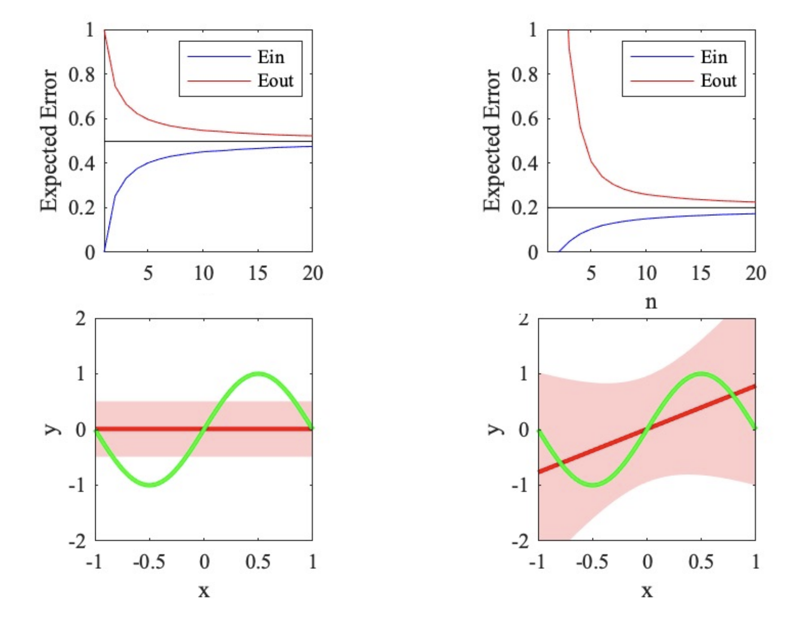

# Generalization 👻

Generalization refers to a model's ability to perform well on new, unseen data. In linear regression, achieving good generalization means that the model captures the underlying trend in the data without overfitting or underfitting.

## Need to know for this section 👨🏽‍💻

### Bias and Variance

- <mark>**_Bias_**:</mark>

  Bias is the error introduced by approximating a real-world problem (which may be complex) by a simplified model. In linear regression, high bias often occurs when the model is too simple to capture the underlying patterns in the data.

  > **_High bias_** can lead to underfitting, where the model fails to capture the underlying trend and performs poorly on both training and test data.

- <mark>**_Variance_**:</mark>

  Variance is the error introduced by the model’s sensitivity to fluctuations in the training data. High variance occurs when the model is too complex and learns not only the underlying patterns but also the noise in the training data.

  > **_High variance_** can lead to overfitting, where the model performs very well on training data but poorly on test data due to its excessive complexity.

 

 

> For the left img is "high bias but low variance". On the other hand, the right img is "low bias and high varaince". Which both cause the overfitting and underfitting!

### Overfitting vs. Underfitting

- Overfitting:

  Occurs when a model learns the noise in the training data rather than the actual signal. This results in excellent performance on training data but poor performance on new, unseen data.

  <mark>High variance, low training error, high test error. (low bias)</mark>

- Underfitting:

  Occurs when a model is too simplistic to capture the underlying patterns in the data. This results in poor performance on both training and test data.

  <mark>High bias, high training error, high test error.</mark>

### Goal Representation

Bias vs. Variance Trade-off:

- **_High Bias (Underfitting)_** ⟶ Simple Model ⟶ High Training Error, High Test Error
- **_Low Bias, Low Variance_** ⟶ Optimal Model ⟶ Low Training Error, Low Test Error
- **_High Variance (Overfitting)_** ⟶ Complex Model ⟶ Low Training Error, High Test Error

> Training error is E in and Testing error is E out

### Note 🚨

We can visualize overfitting and underfitting by making a learning curve. You can follow the link https://github.com/Kariusdi/Machine-Learning-Class67/tree/main/LearningCurve.
