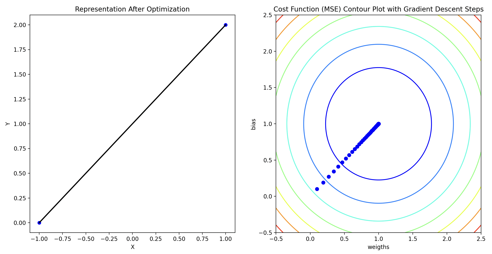
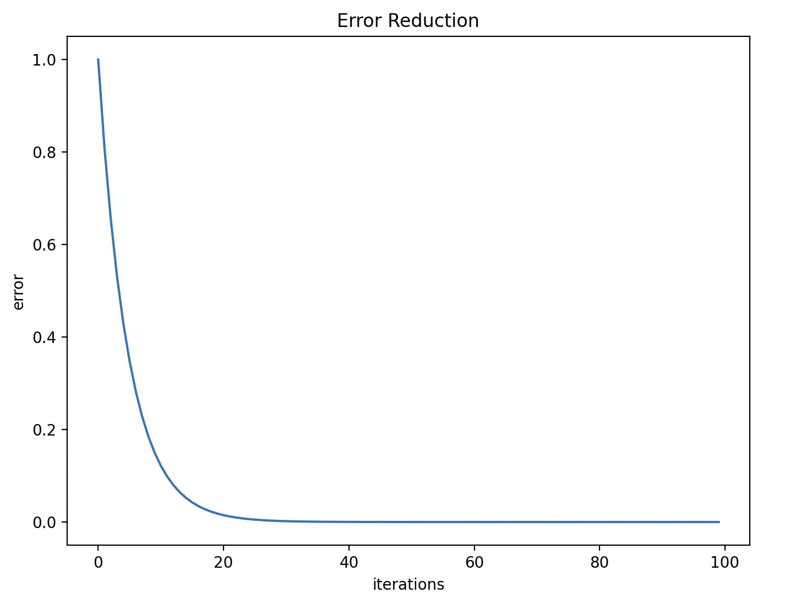

## 2). When X values are super different, how we can improve the data by standardization?

- เขียนโปรแกรมสำหรับแสดงผลกระทบต่อการทำงานของวิธีลดตามความชันและฟังก์ชันค่าใช้จ่าย เมื่อตัวแปร x หลายตัวมีค่าแตกต่างกันมาก และแสดงผลของการปรับปรุงประสิทธิภาพด้วยการทำให้เป็นมาตรฐาน (Lecture หน้าที่ 61)

> "Note" we're gonna use metrix for calculation instead of loop. And the full code is written as a Class in the "model" directory.
> </br>
> 🫧 And also in the example, there's just 1 feature.

### Sample Data

```python
X_data = [[0], [200]]
y_data = [0, 2]
```

## Let's start! 🚀

</br>

> In this point, we aren't going to talk about every step because it's the same as 01 assignment but just add standardization.

## <mark>Why we need to standardize it ?</mark>

As you can see from the dataset, the diffenrence between x1 and x2 is super high. If we train this dataset without standardize it. There're several things that we need to concern.

- **Gradient-Based Optimization**: Algorithms like gradient descent can converge more slowly when the input features are not standardized. This is because features with larger ranges can dominate the gradient and cause the algorithm to take steps that are too large or too small, making the training process inefficient.

- If the features are not standardized, the coefficients can become difficult to interpret, and the optimization process may be affected.

etc.

## <mark>How can we standardize the data ?</mark> 🐊

The formula of standardization for linear regression algorithm is

```math
X standardized = \frac{X - \mu X} {\sigma}
```

where:

- \( X \) is the original value of the feature.
- \( mu \) is the mean of the feature values.
- \( sigma \) is the standard deviation of the feature values.
- \( X standardized) is the standardized value of the feature.

So we can implement that in python by using numpy.

```python
def standardization(self, X):       # X_std = X - mean of X / standard deviation of X
    mean_x = np.array([np.mean(X)])
    std_x = np.array([np.std(X)])
    X_std = (X - mean_x) / std_x
    return X_std
```

And now we have to use this before pass the data to the training process.

```python
X_data = [[0], [200]] # X represents to be a row (samples)
y_data = [0, 2]       # Y represents to be a column (output)

X = np.array(X_data)
y = np.array(y_data)

linear = LinearRegression(lr=0.1, n_iters=100)  # start by learning rate sets to be 0.1 with number of 100 iterations (less data => high lr)
X_std = linear.standardization(X)               # standardize Data (Normalization)
linear.training(X_std, y, "gradientDes")        # optimize by using gradient descent
```

### Let's see the result! ✨

## <mark>Result</mark>


</br>

##


</br>

## <mark>Bonus</mark>🔥

## Why the shape of contour is circle when we have standardized the data?

In linear regression, the shape of the contour plot of the cost function with respect to the weights (w_0 and w_1) depends on the scale and correlation of the input features.

- When Data is Standardized:

  1. **_Standardization_**: Standardizing the data involves scaling the features so that they have a mean of 0 and a standard deviation of This means the transformed features will have the same scale.
  2. **_Cost Function Symmetry_**: When the features are on the same scale, the cost function's contours become symmetric around the minimum point. This symmetry results in circular contours because the cost function is equally sensitive to changes in any direction in the parameter space.
  3. <mark>**_Gradient Descent_**</mark>: Circular contours imply that gradient descent can move equally efficiently in any direction, leading to better convergence properties.

- When Data is Not Standardized: (In assigment 01, we didn't standardize it.)
  1. **_Original Scale_**: When the features are not standardized, they can have very different scales. For instance, one feature might range from 0 to 200, while another might range from 0 to 2.
  2. **_Cost Function Asymmetry_**: This disparity in scales causes the cost function to be more sensitive to changes in the weights associated with larger-scale features. The result is elliptical (oval) contours that stretch more in the direction of the less sensitive feature.
  3. **_Gradient Descent_**: Elliptical contours indicate that the cost function's gradient is much steeper in one direction than in the other. This can cause gradient descent to take inefficient, zigzagging paths toward the minimum, slowing down convergence.

##
