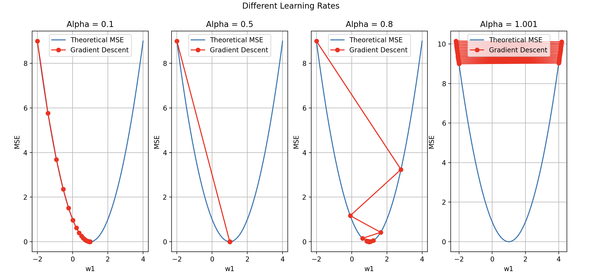

## 4). Show the difference MSE if we are using difference "Learning Rate".

- เขียนโปรแกรมสำหรับแสดงผลของการปรับพารามิเตอร์การเรียนรู้ (Lecture หน้าที่ 66)

> "Note" we're gonna use scalar for visualization in this point. And using "alpha" instead of "learning rate".

## Let's start! 🚀

## <mark>What is Learning Rate?</mark>

Learning rate is the value that tells you about "How fast you want me to go downhills (go to the minimum of error)" and releted to iterations. Learning rate is how long is your each step. On the other hand, iterations also tell you how many hours do you have to run.

## <mark>Let's visulize it</mark>

### Learning Rate set that we are gonna use to see the diff

```python
alpha = [0.1, 0.5, 0.8, 1.001]  # Learning rate
```

The code that we are gonna use was coded by Sirapoap (my classmate). He's using for loop to show 4 figs for each learning rate compare with MSE that falls down for each iteration.

```python
fig, graph = plt.subplots(1, 4, figsize=(20, 6)) # size = 1 row 4 column 20*6

for i, alpha in enumerate(alpha): # enumerate = ดึงทั้งค่า index and value
    w1_history = []
    mse_history = []
    mse0 = []
    w1_linspace = np.linspace(-2, 4, 100) # สร้างเส้นเนื่องจาก w1_history มีการเปลี่ยน learnningRate
    for w1_value in w1_linspace:
        mse0.append(mean_squared_error(x, y, 0, w1_value)) #error จาก w1_linspace

    # Perform gradient descent starting with w1 = -4 for each alpha
    w0, w1 = gradient_descent(x, y, 0, -2, alpha, iterations)
    graph[i].plot(w1_linspace, mse0, label='Theoretical MSE')
    graph[i].plot(w1_history, mse_history, '-o', color="red", label='Gradient Descent')
    graph[i].set_title(f'Alpha = {alpha}')
    graph[i].set_xlabel('w1')
    graph[i].set_ylabel('MSE')
    graph[i].grid(True)
    graph[i].legend()
```

## <mark>Result</mark>

<<<<<<< HEAD

=======

>>>>>>> 4ba4662 (:memo: : 03 added.)
</br>

As you can see, falling down steps of MSE that they're so different for each learning rate. If you set the if we set learning rate too low, the model takes a lot of time to fit the data and wants more iteration. On the other hand, if we set it to high the model would jump across the minimum and hard to fit the model. (Actually, I have explained this in 01 assignment already)

##
