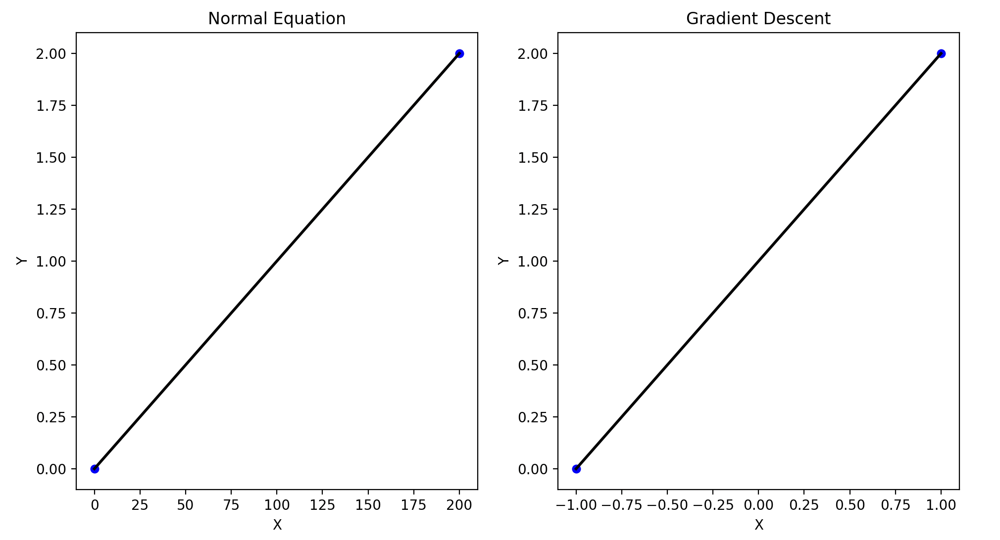

## 4). Compare the result after optimizing with "Gradient Descent" and "Normal Equation".

- เขียนโปรแกรมสำหรับเปรียบเทียบผลลัพธ์ที่ได้จากวิธีสมการปรกติและวิธีลดตามความชัน (Lecture หน้าที่ 57 และ 59)

> "Note" we're gonna use metrix for calculation instead of loop. And the full code is written as a Class in the "model" directory.
> </br>
> 🫧 And also in the example, there's just 1 feature.

### Sample Data

```python
X_data = [[0], [200]]
y_data = [0, 2]
```

## Let's start! 🚀

</br>

## <mark>What is Normal Equation ?</mark>

The Normal Equation directly computes the optimal parameters 𝜃 (weight) without needing iterative optimization algorithms like gradient descent.

So, we can use this equation as following..

```math
w = (X^TX)^-1 * X^Ty
```

Here’s a breakdown of each term:

- X^T: The transpose of the matrix X.
- X^T \* X: The dot product of X^T and X. This results in a square matrix.
- (X^T _ X)^-1: The inverse of the matrix (X^T _ X).
- X^T \* y: The dot product of X^T and the vector y. This results in a vector.

## <mark>How can we implement it in Python ?</mark>

As you already know, we can use numpy to implement this as always.

```python
def normalEquation(X, y):
    new_weights = np.linalg.inv(X.T.dot(X)).dot(X.T.dot(y)) # w = (XT * X)^-1 * (XT * y)
    return new_weights
```

> Which is np.linalg.inv(): is the function to "inverse" the metrix

After we have done the code, so we can actually test it know by comparing with Gradient descent ! 👨🏽‍💻

## <mark>Result comparision between "Gradient Descent" and "Normal Equation"</mark>


</br>

As you can see on the fig, The result looks totally the same. But the difference between them is when we are using **"Normal equation"**, we don't have to standardize the data because it calculates with the formular that don't need iterations (X axis is max to 200). On the other hand, **"Gradient Descent"** still needs to be standardized to avoid the complex direction to the minimum of error (X axis is max to the standardize value).

However, Normal Equation becomes computationally expensive for large datasets because it involves matrix inversion, which has a time complexity of O(n3). It suits to small datasets more that large datasets. You have to think and make a decision what is the best for your datasets! 🧑‍🔬
