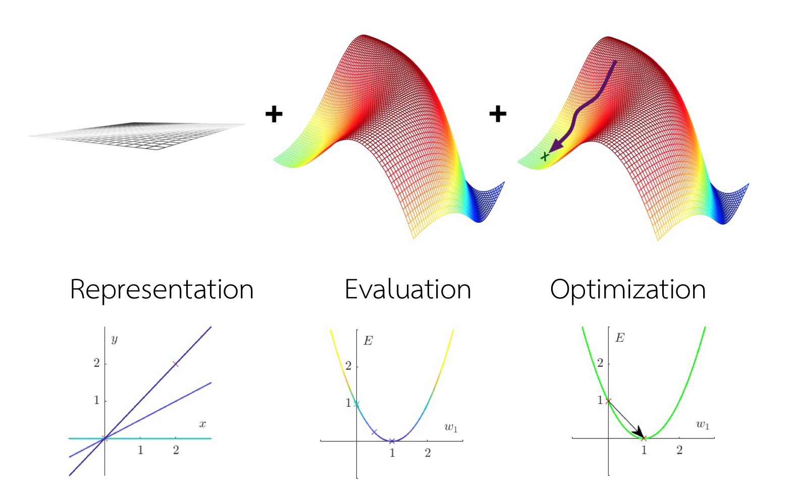
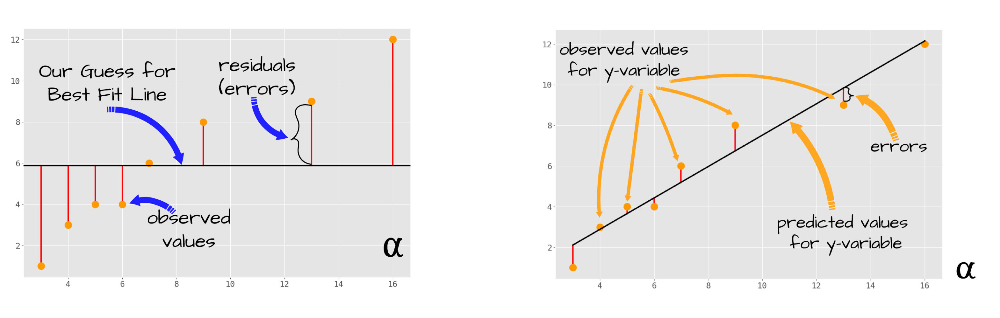
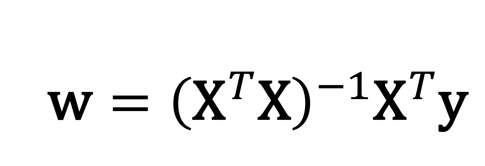
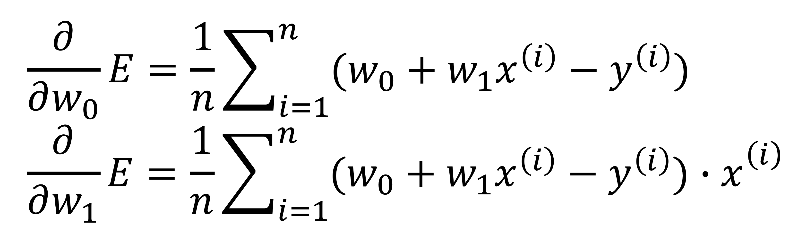

# Linear Regression 📈

Linear Regression is the **_Supervised Learning_** that can predict the output as a continuous. For example, if we have gender and height as features and weigth as a output. We can use linear regression to predict the weigth when new data has come.

## Need to know for this section 👨🏽‍💻

### Machine Learning Components

- Representation
- Evaluation
- Optimization


</br>

these can use to represent the steps of linear regression as well, which are

### Steps of linear regression

1. **Representaion**: Linear Regression equation

```math
h(x) = w_0 + w_1 x_1 + w_2 x_2 + ... + w_d x_d
```

> where w_0 is a bias, w_d is weigths, and x are features.

2. **Evalution**: In this term, we'll use MSE (Mean Squared Error) to define errors of the diff between predicted value and actual value and think how we can optimize weigths to decrease errors.

```math
\text{MSE} = \frac{1}{n} \sum_{i=1}^{n} (y_i - \hat{y_i})^2
```

> where y_i are the true values (output from dataset) and y_hat are the predicted values that we got from the model.


</br>

3. **Optimization**: After we got the model. Of course the predicted values have errors (calculate from MSE that we have mentioned eariler). So we have to optimize the model to fit the data as well as possible.

   - There are 2 optimizations that we're gonna use in this term.

     1. **Normal Equation**: Calculate just 1 time and get the new weight immedietly. It suits with the small datasets.
        
        </br>
     2. **Gradient Descent**: Random starter weight (typically, we're gonna start at 0) and adjust weigth untill errors has been descreased to the minimum.
        
        </br>

##

## Assignments

### [01](https://github.com/Kariusdi/Machine-Learning-Class67/blob/main/Linear-Regression/01/README.md)

### [02](https://github.com/Kariusdi/Machine-Learning-Class67/blob/main/Linear-Regression/02/README.md)

### [03](https://github.com/Kariusdi/Machine-Learning-Class67/blob/main/Linear-Regression/03/README.md)

### [04](https://github.com/Kariusdi/Machine-Learning-Class67/blob/main/Linear-Regression/04/README.md)
