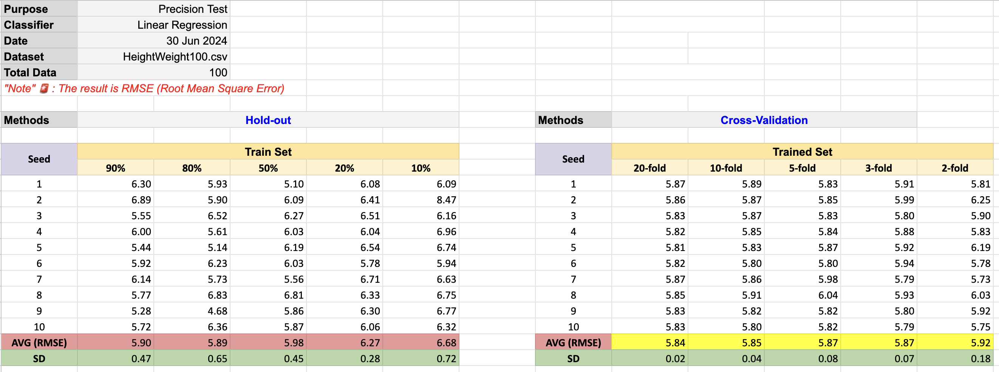

# Performance Estimation using Python 🐍

From the experiments that we have tested with **_WEKA_** by using 3 methods, which are

- Hold Out
- K-fold Cross Validation
- Resubstitution

In this time, we are gonna use the same experiments but **_implementing_** with Python instead.

> we are not gonna implement it from scratch, we are gonna use libs for this.

## Proposition

1. เขียนโปรแกรมเพื่อทดสอบความเที่ยงตรง (Precision) และการทดสอบความแม่นยํา (Accuracy) ของวิธี Resubstitution, Holdout และ Cross Validation โดยใช้ข้อมูล height weight โดยให้ออกแบบการทดลองเอง

What we have to do is design the experiment by ourself. So we need to define

- **Seed** (How many step to we want to test)
- **Sample Size**
- **Train / Test percentage** (for Hold Out method)
- **K-fold size** (for Cross Validation method)

and the dataset that we use is **HeightWeight.csv**

We have done the experiment planning, so LET'S START!! ⚡️

## <mark>Firstly, **_Initializing Methods_**</mark>

Of course, we're gonna have 3 methods for all experiments

- Hold Out

```python
def HoldOut(df, Y_col, testsize):
    X = df.drop(columns=[Y_col])
    Y = df[Y_col]

    X_train, X_test, Y_train, Y_test = train_test_split(X, Y, test_size=testsize, random_state=0)

    model = LinearRegression()
    model.fit(X_train, Y_train)

    y_pred = model.predict(X_test)

    RMSE = root_mean_squared_error(Y_test, y_pred)
    return RMSE
```

- K-fold Cross Validation

```python
def CrossValidation(df, Y_col, fold):
    X = df.drop(columns=[Y_col])
    Y = df[Y_col]

    kf = KFold(n_splits=fold, shuffle = True, random_state=0)

    rmse_values = []
    for train_index, test_index in kf.split(X):
        X_train, X_test = X.iloc[train_index], X.iloc[test_index]
        y_train, y_test = Y.iloc[train_index], Y.iloc[test_index]

        model = LinearRegression()
        model.fit(X_train, y_train)

        # Make predictions on the test set
        y_pred = model.predict(X_test)

        # Calculate RMSE for this fold
        rmse_fold = root_mean_squared_error(y_test, y_pred)
        rmse_values.append(rmse_fold)
    RMSE = np.mean(rmse_values)
    return RMSE
```

- Resubstitution

```python
def Resubstitution(df, Y_col):
    X, y = Initialize_Data(df, Y_col)

    # Initial model with all data
    model = LinearRegression()
    model.fit(X, y)

    Y_pred = model.predict(X)

    RMSE = root_mean_squared_error(y, Y_pred)
    return RMSE
```

All of methods we use RMSE to define the error of the model.

> I'm not gonna summarize the result of each experiment because it's totally the same in google sheet link in the main README of this directory.

## <mark>Experiment 1 and 2</mark>

- result from WEKA


</br>

- code

In this lab, we are using Hold out method with 5 splits, which are [0.9, 0.8, 0.5, 0.2, 0.1] to see the difference. And seed is 1000 with sample size of 1000 as well. The results of testing are RMSE and SD for each split. As well as that, we are using [20, 10, 5] folds for Cross Validation method with the same seed and sample size as Hold Out method that I have mentioned before.

```python
def Lab1(df, holdout_split, random_state, sample_size):
    y = "Weight"
    holdOut_log_main = {split: [] for split in holdout_split}

    for i in holdout_split:
        for seed in range(random_state):
            df = random_data(df, seed=seed, sample_size=sample_size)
            holdOut_log_main[i].append(HoldOut(df, y, i))


    holdout_df = pd.DataFrame(holdOut_log_main)
    holdout_df.loc["Average"] = holdout_df.mean()
    holdout_df.loc["SD"] = holdout_df.std()

    return holdout_df

def Lab2(df, cross_kfold, random_state, sample_size):
    y = "Weight"
    cross_log_main = {folds: [] for folds in cross_kfold}

    for i in cross_kfold:
        for seed in range(random_state):
            df = random_data(df, seed=seed, sample_size=sample_size)
            cross_log_main[i].append(CrossValidation(df, y, i))


    crossval_df = pd.DataFrame(cross_log_main)
    crossval_df.loc["Average"] = crossval_df.mean()
    crossval_df.loc["SD"] = crossval_df.std()
    return crossval_df

# Lab 1
holdout_arr = [0.9, 0.8, 0.5, 0.2, 0.1]
result_lab1 = Lab1(df, holdout_split=holdout_arr,random_state=100, sample_size=1000)
print("\nHoldout Results Table:")
print(result_lab1)

# Lab 2
crossval_arr = [20, 10, 5]
result_lab2 = Lab2(df, cross_kfold=crossval_arr, random_state=100, sample_size=1000)
print("\nCross-Validation Results Table:")
print(result_lab2)
```

## <mark>Experiment 3</mark>

- result from WEKA


</br>

- code

In this lab, we are testing almost the same as experiment 1 and 2 above but just change the sample size to be smaller.

```python
def Lab3(df, random_state, holdout_split, cross_kfold, sample_size):
    y = "Weight"

    holdOut_log = []
    for seed in range(random_state):
        df = random_data(df, seed=seed, sample_size=sample_size)
        holdOut_log.append(HoldOut(df, y, holdout_split))

    avg_holdOut = np.mean(holdOut_log)
    sd_holdOut = np.std(holdOut_log)

    cross_log = []
    for seed in range(random_state):
        df = random_data(df, seed=seed, sample_size=sample_size)
        cross_log.append(CrossValidation(df, y, cross_kfold))

    avg_cross = np.mean(cross_log)
    sd_cross = np.std(cross_log)

    return avg_holdOut, avg_cross, sd_holdOut, sd_cross

# Lab 3
avg_holdOut, avg_cross, sd_holdOut, sd_cross, combined_df = Lab3(df, random_state=100, holdout_split=0.5, cross_kfold=10, sample_size=100)
print("\n Lab 3 ")
print(combined_df)
print(f"Lab 3 Average Holdout RMSE: ", avg_holdOut)
print(f"Lab 3 Average Cross-Validation RMSE: ", avg_cross)
print(f"Lab 3 Holdout RMSE SD: ", sd_holdOut)
print(f"Lab 3 Cross-Validation RMSE SD: ", sd_cross)
```

## <mark>Experiment 4</mark>

- result from WEKA


</br>

- code

Finally the last lab, we are testing about performance comparision between 3 methods. Which are Hold Out, K-fold Cross Validation, and Resubstitution with the sample size of 10000.

```python
def Lab4(df, random_state, holdout_split, cross_kfold, sample_size):
    y = "Weight"
    avg_holdOut, avg_cross, sd_holdOut, sd_cross, combined_df = Lab3(df, random_state, holdout_split, cross_kfold, sample_size)

    resub_log = []
    for seed in range(random_state):
        df = random_data(df, seed=seed, sample_size=sample_size)
        resub_log.append(Resubstitution(df, y))

    avg_resub = np.mean(resub_log)
    sd_resub = np.std(resub_log)
    resub_df = pd.DataFrame(resub_log, columns=['Resubstitution'])
    resub_df.loc["Average"] = avg_resub
    resub_df.loc["SD"] = sd_resub

    combined_df = pd.concat([combined_df, resub_df], axis=1)
    return avg_holdOut, avg_cross, avg_resub, sd_holdOut, sd_cross, sd_resub, combined_df

# Lab 4
avg_holdOut, avg_cross, avg_resub, sd_holdOut, sd_cross, sd_resub, combined_df = Lab4(df, random_state=100, holdout_split=0.5, cross_kfold=10, sample_size=1000)
print("\n Lab 4 ")
print(combined_df)
print(f"Lab 4 Average Holdout RMSE: ", avg_holdOut)
print(f"Lab 4 Average Cross-Validation RMSE: ", avg_cross)
print(f"Lab 4 Average Resubstitution RMSE: ", avg_resub)
print(f"Lab 4 Holdout RMSE SD: ", sd_holdOut)
print(f"Lab 4 Cross-Validation RMSE SD: ", sd_cross)
print(f"Lab 4 Resubstitution RMSE SD: ", sd_resub)
```

## Bonus 🔥

If we want to know the accuracy of the model. We couldn't use the RMSE after testing to tell that like Oh! this is a low RMSE that absolutely means it's accurate!

We don't do that because there's no reference to compare with to tell that it's accurate. But we can make a reference from training the model the whole dataset and get the RMSE of it. After we got the reference, we can use it to be a standard of accuracy that tells if RMSE of any model is closer to this reference then that model might accurate ✅. Something like that.

> It's better, if RMSE from any model is closer to reference from above more than from below!
