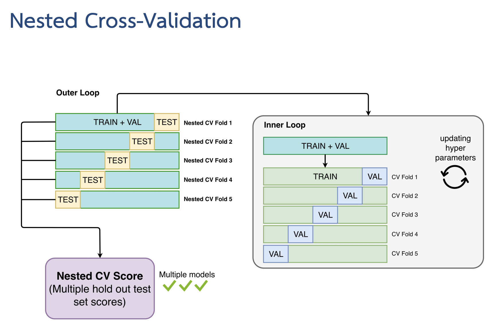

# Nested Cross-Validation 🧵

Nested cross-validation is a robust technique used to evaluate the performance of a machine learning model and to tune its hyperparameters. It involves two nested loops of cross-validation to avoid overfitting and to ensure that hyperparameter tuning does not bias the model evaluation.

 

> We use Jupytor notebook for this section

## Need to know for this section 👨🏽‍💻

### How It Works

1. <mark>**_Outer Cross-Validation Loop:_**</mark>

   - Purpose: Estimates the generalization performance of the model.

   - Process: The dataset is divided into several folds (e.g., 5 or 10). For each iteration, one fold is held out as the test set, while the remaining folds are used for training and hyperparameter tuning.

2. <mark>**_Inner Cross-Validation Loop:_**</mark>

   - Purpose: Selects the best hyperparameters for the model.

   - Process: Within each training set from the outer loop, the data is further split into training and validation sets. The model is trained on the training set with different hyperparameters and evaluated on the validation set to find the optimal hyperparameters.

### Benefits

- **Unbiased Evaluation:** Provides an unbiased estimate of the model's performance by ensuring that hyperparameter tuning does not influence the test set performance.

- **Robustness:** Helps in selecting the best model and its hyperparameters while mitigating overfitting.

### Example Use

Nested cross-validation is particularly useful for models with many hyperparameters or when working with small datasets, as it provides a reliable estimate of model performance and parameter settings.
