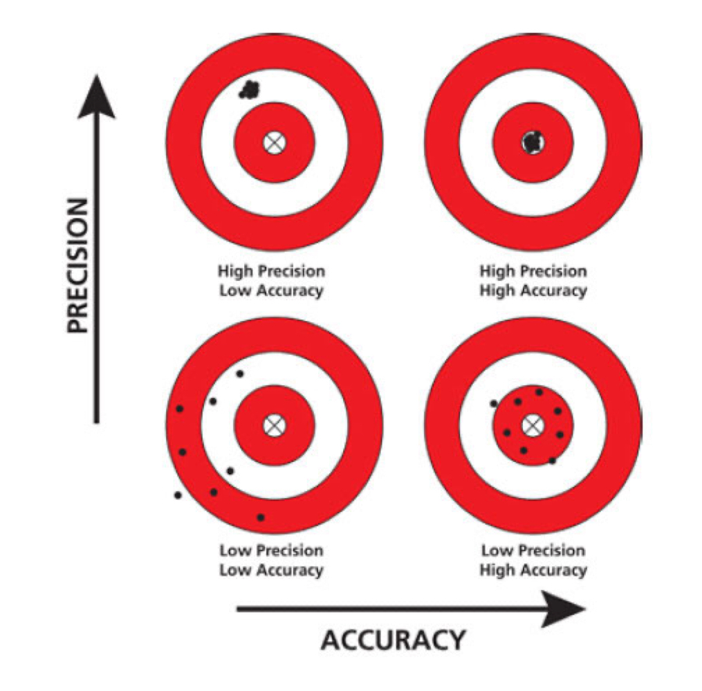

# Performance Estimation ⚡️

In this chapter, we are going to use WEKA to visualize the performance of ML model in term of "precision" and "accuracy" with differences methods.

> The test results are in the link below. ⬇️

[https://docs.google.com/spreadsheets/d/11HBqf4iq6L8h1zfKdO5Nwn-z6gsd7zeO0jDJNbXjPtg/edit?usp=sharing](https://docs.google.com/spreadsheets/d/1R_fPmHHT9pcqWLS3Dwo1KzI3gZ4Rjlj3/edit?gid=2115504968#gid=2115504968)

## <mark>Precision and Accuracy</mark>

 

## <mark>Explaination about RMSE and SD of RMSE that refers to "precision" and "accuracy"</mark>

The standard deviation (SD) of RMSE (Root Mean Square Error) can provide insights into the consistency and reliability of a model's performance across different subsets of data. Here’s how to interpret a low SD of RMSE:

- ### **_Precision_**

  Low SD of RMSE indicates high precision. This means that the model's performance is consistent across different subsets of data or across multiple training and testing cycles. In other words, the model produces similar RMSE values repeatedly, indicating that its predictions are stable and not subject to significant variation.

- ### **_Accuracy_**

  Accuracy refers to how close the predictions are to the actual values. While low SD of RMSE suggests that the model’s performance is consistent, it does not necessarily mean that the predictions are accurate. The RMSE itself would tell you about the accuracy: a low RMSE value means the predictions are generally close to the actual values (high accuracy).

### Summary

- ### **_Low SD of RMSE_**:

  **High precision**: The model’s performance is consistent.
  Does not directly indicate accuracy but suggests reliability in performance.

- ### **_Low RMSE_**:

  **High accuracy**: Predictions are close to the actual values.
  To conclude, a low SD of RMSE means that the precision of the model is high, meaning its performance is consistent. However, you also need to look at the actual value of RMSE to determine the accuracy of the model.
