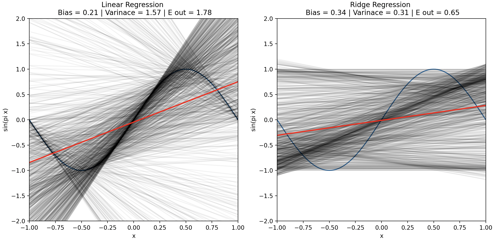
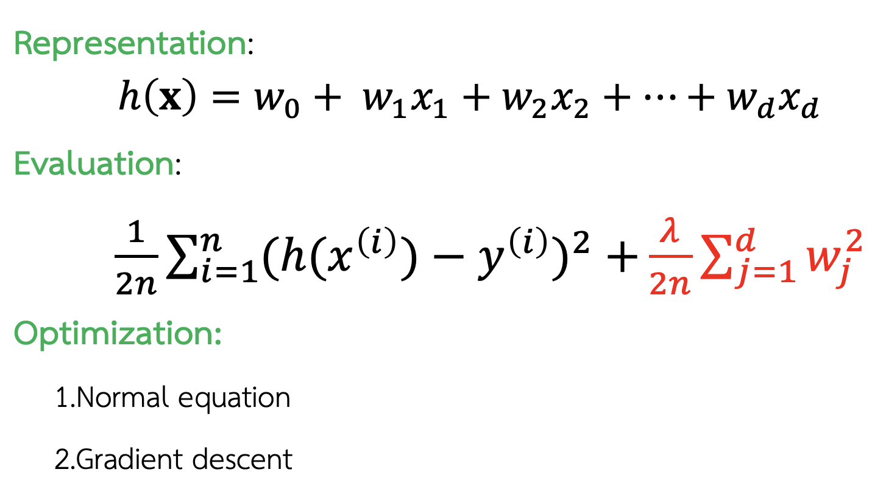
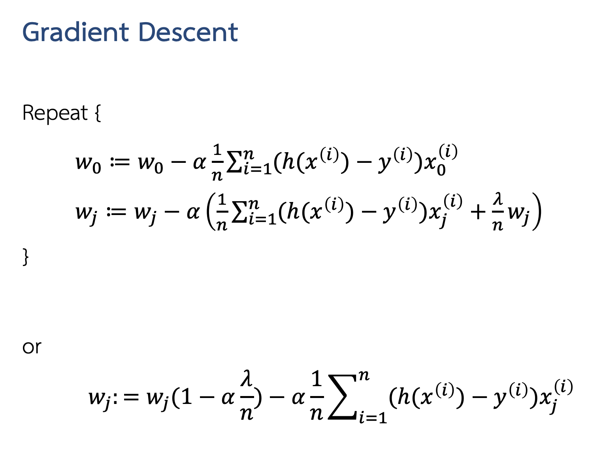
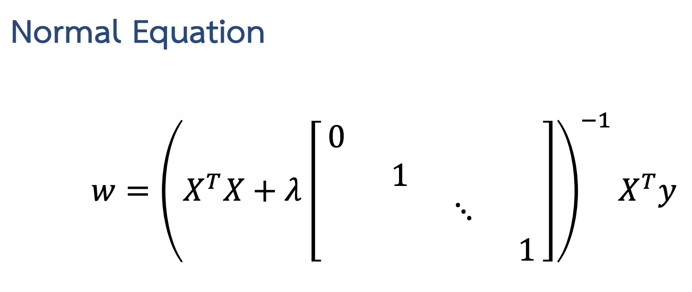

# Regularization 🦺

### Why Regularization?

In linear regression, the goal is to find the best-fitting line (or hyperplane in higher dimensions) through the data. However, if the model is too complex (e.g., using too many features or having excessively large weights), it may fit the training data very well but perform poorly on new data due to overfitting. Regularization helps address this issue by constraining or penalizing the complexity of the model by **_increasing bias_** a bit for **_decreasing variance_**. Which make the model isn't overfitting and it gets a better performance.

> Example of **_increasing bias_** a bit for **_decreasing variance_**


</br>

## Need to know for this section 👨🏽‍💻

### Types of Regularization

1. <mark>**Ridge Regression (L2 Regularization):**</mark>

   **_Defination_**

   Ridge regression shrinks the coefficients towards zero but does not necessarily set them to zero. This leads to a model where all features are included, but their effects are reduced, making the model simpler and more robust.

   **_Penalty Term_**

   The penalty term **_λ _ ∑ w_j^2\*** is the sum of the squares of the model coefficients. This term discourages large coefficients by adding their squared values to the loss function.

   **_Loss function Form_**:

   ```math
   Loss = MSE + λ * ∑ w_j^2
   ```

   **_Machine Learning Components for Linear Regression_**

   
   </br>

   
   </br>

   
   </br>

   > we have to define identity metrix for normal equation as the last fig

2. <mark>**Lasso Regression (L1 Regularization):**</mark>

   **_Definition_**

   Lasso regression encourages sparsity in the model by driving some coefficients exactly to zero, effectively selecting a subset of features. This can simplify the model and aid in feature selection.

   **_Penalty Term_**

   The penalty term λ ∑ | w_j | is the sum of the absolute values of the model coefficients. This term discourages large coefficients by adding their absolute values to the loss function.

   **_Loss function Form:_**

   ```math
   Loss = MSE + λ * ∑ |w_j|
   ```

3. <mark>**Elastic Net Regression:**</mark>

   **_Definition_**

   Elastic Net regression combines both Ridge and Lasso regression. It provides a balance between Lasso and Ridge regression by including both sparsity (feature selection) and coefficient shrinkage. This can be particularly useful when dealing with highly correlated features.

   **_Penalty Term_**

   The penalty term λ_1 ∑ |w_j| + λ_2 ∑ w_j^2 is a combination of the L1 and L2 penalties. This term balances between encouraging sparsity (L1) and shrinking coefficients (L2).

   **_Loss function Form:_**

   ```math
   Loss = MSE + λ_1 * ∑ |w_j| + λ * ∑ w_j^2
   ```

### How It Works?

- **_Loss Function:_** Regularization modifies the loss function (e.g., Mean Squared Error) by adding a penalty term. This term discourages overly large weights or a large number of non-zero weights.

- **_Regularization Parameter (λ):_** Controls the strength of the penalty. A higher 𝜆 increases the penalty, leading to more regularization, and a lower λ decreases the penalty, making the model closer to a regular linear regression.

### Benefits of Regularization

1. Reduces Overfitting: By penalizing large coefficients, regularization helps the model generalize better to new data.
   Feature Selection: L1 regularization can help in feature selection by shrinking some coefficients to zero.

2. Improves Stability: Helps in making the model more stable and robust, especially when dealing with multicollinearity (highly correlated features).

### Summary 💼

In summary, regularization helps control model complexity, improves generalization, and enhances the performance of linear regression models by adding a penalty for large coefficients.

> Please follow this link, it's very helpful.

https://youtu.be/Xm2C_gTAl8c?si=kVIxoW-fcGWpWEi3
https://www.youtube.com/watch?v=Q81RR3yKn30
